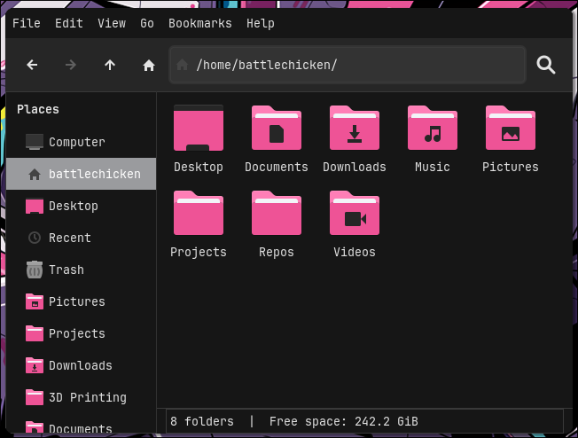
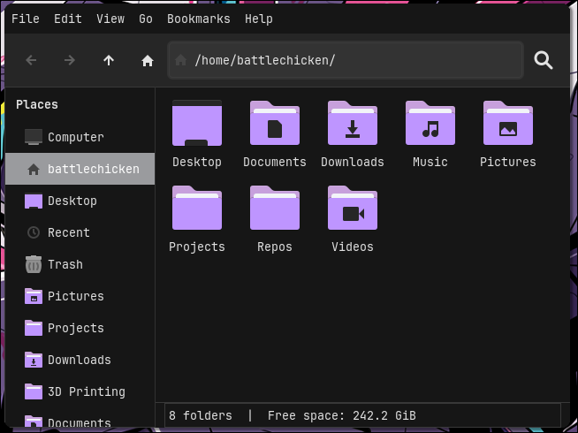
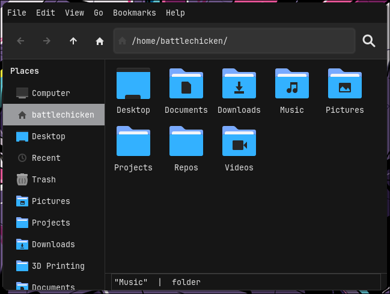

<div align="center">

# oxocarbon-papirus-icons

</div>

<div align="center">

[](https://github.com/nyoom-engineering/oxocarbon/stargazers)
[](https://github.com/nyoom-engineering/oxocarbon/issues)
[](https://mit-license.org/)


</div>

A port of of the Papirus Icon Theme to the Oxocarbon color pallete. 


## Showcase







## Install

1. Make sure You have [Papirus Icon Theme](https://github.com/PapirusDevelopmentTeam/papirus-icon-theme) installed
2. Clone this repository and change to cloned directory:
   ```
   git clone https://github.com/BattleCh1cken/oxocarbon-papirus-folders.git
   cd oxocarbon-papirus-folders
   ```
3. Copy content of `src` to `/usr/share/icons/Papirus/`:
   ```
   sudo cp -r src/* /usr/share/icons/Papirus
   ```
4. Use modified `papirus-folders` script to set colors of folders. For example to set oxocarbon-pink folders for Papirus-Dark theme:
   ```
   ./papirus-folders -C oxocarbon-pink --theme Papirus-Dark
   ```
5. To check all available colors:

   ```
   ./papirus-folders -l
   ```


6. Visit [Papirus-folders](https://github.com/PapirusDevelopmentTeam/papirus-folders) to learn more about this script

## License

The project is licensed under the MIT license
